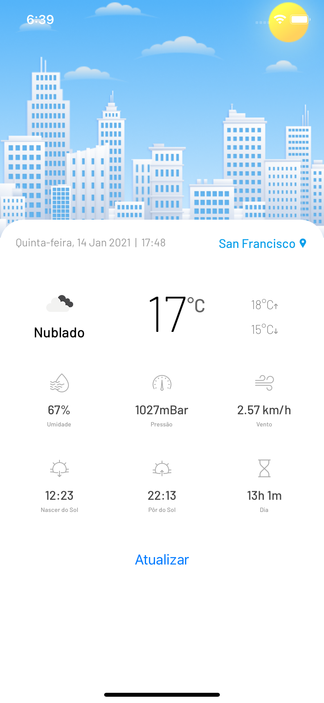
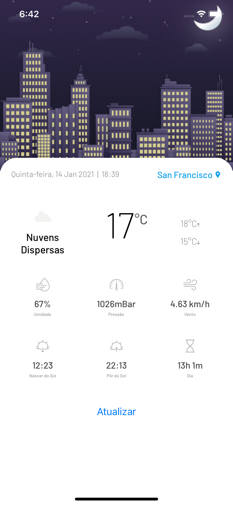

## 💻 Sobre o projeto

Weather App - é um aplicativo de previsão do tempo que usa a localização do usuário para obter dados do clima, bem como para mostrar o local, data e hora.

---

## ⚙️ Funcionalidades

- [x] Os usuários tem acesso ao aplicativo móvel, onde podem:
  - [x] Visualizar a sua cidade atual, dia da semana, data e hora
  - [x] Visualizar dados do clima de sua localização (latitude e longitude) como temperatura, pressão atmosférica e etc.
  - [x] Ao pressionar o botão ```Atualizar```, uma nova consulta é feita e os dados climáticos atualizados.

---

## 🎨 Layout

O layout é simples e clean. Utiliza tons claros, o banner é dinâmico e trocado de acordo com o horário do usuário. Abaixo uma breve demonstração.

<p align="center">
  

  
</p>

---

## 🚀 Como executar o projeto

### Estrutura

```
📦 src
 ┣ 📂 assets (arquivos estáticos, como fontes, imagens, ícones etc.)
 ┣ 📂 commons (quando não são componentes, e devem ser reutilizáveis)
 ┣ 📂 components (para componentes reutilizáveis)
 ┣ 📂 modules (módulos com lógica de negócio/duck files)
 ┣ 📂 services (integração com apis, separados por lógica de negócio acompanhando os modules)
 ┣ 📂 utils (utilitários como funções de formatação, checagem de conectividade, classe base de http etc.)
 ┣ 📂 screens
 ┃ ┗ 📂 NotAuthenticated
 ┃ ┃ ┣ 📂 Home
 ┃ ┃ ┃ ┣ 📜 index.tsx (arquivo principal, que contém a view)
 ┃ ┃ ┃ ┣ 📜 styles.ts (onde fica todo o style do componente)
 ┃ ┃ ┃ ┗ 📜 types.ts (todos os tipos pertencentes à esta tela)
 ┃ ┃ ┣ 📂 Error
 ┃ ┃ ┃ ┣ 📜 index.tsx
 ┃ ┃ ┃ ┗ 📜 styles.ts
 ┃ ┃ ┗ 📜 stack-navigator.tsx
 ┣ 📜 App.tsx (componente principal, onde ficam os providers)
 ┣ 📜 reducers.ts (onde ficam os reducers combinados)
 ┣ 📜 root-navigator.tsx (rotas raíz do projeto)
 ┗ 📜 store.ts (configuração da redux store)
```

### Pré-requisitos

Antes de começar, você vai precisar ter instalado em sua máquina as seguintes ferramentas:
[Git](https://git-scm.com), [Node.js](https://nodejs.org/en/). Além disto, você vai precisar ter uma uma `API KEY` [OPEN WEATHER API](https://home.openweathermap.org/users/sign_up), para isso se inscreva no site da [OPEN WEATHER API](https://home.openweathermap.org/users/sign_up) e obtenha uma `API KEY` gratuita, ela já é o suficiente para rodar o projeto. Após obter a sua `API KEY`, crie um arquivo `.env` na raiz do projeto e preencha-o seguindo o modelo do `.env.template` que já existe na raiz do projeto, lá já está preenchido as Url's, basta colocar sua `API KEY` e o timeout desejado. A [OPEN WEATHER API](https://home.openweathermap.org/users/sign_up) às vezes é lenta, por isso é aconselhável um timeout de 9000ms pra cima. O seu arquivo `.env`, deve ficar dessa maneira:

```
OPEN_WEATHER_URL=https://api.openweathermap.org/data/2.5
OPEN_WEATHER_ICON_URL=https://openweathermap.org/img/wn
OPEN_WEATHER_KEY=SUA_API_KEY
REQUEST_TIMEOUT=9000 //aqui é o timeout, não é necessário mudar esse valor como citado acima
```

#### 🎲  Rodando a aplicação

```bash

# Clone este repositório
$ git clone git@github.com:patrick-narciso/weather-app.git

# Acesse a pasta do projeto no terminal/cmd
$ cd weather-app

# Instale as dependências
$ yarn install

```

Agora só fazer o boot para algum device físico, ou um emulador. Na forma mais simples, basta executar:

### Android

```shell
$ yarn android
```

### iOS

Primeiramente, vamos instalar os pods do projeto

```shell
$ npx pod-install
```

Agora podemos fazer o launch, com o comando:

```shell
$ yarn ios
```

---

## 🛠 Tecnologias

As seguintes ferramentas foram usadas na construção do projeto:

#### [](https://github.com/tgmarinho/Ecoleta#mobile-react-native--typescript)**Mobile**  ([React Native](http://www.reactnative.com/)  +  [TypeScript](https://www.typescriptlang.org/))

-   **[React Navigation](https://reactnavigation.org/)**
-   **[React Native DotEnv](https://www.npmjs.com/package/react-native-dotenv/)**
-   **[React Native Permissions](https://www.npmjs.com/package/react-native-permissions/)**
-   **[React Native Geolocation](https://github.com/react-native-geolocation/react-native-geolocation/)**
-   **[React Native NetInfo](https://github.com/react-native-netinfo/react-native-netinfo/)**
-   **[React Native SVG](https://github.com/react-native-community/react-native-svg)**
-   **[Axios](https://github.com/axios/axios)**
-   **[Styled Components](https://styled-components.com/)**
-   **[Redux](https://redux.js.org/)**

> Veja o arquivo  [package.json](https://github.com/patrick-narciso/weather-app/blob/main/package.json)

#### [](https://github.com/tgmarinho/Ecoleta#utilit%C3%A1rios)**Utilitários**

-   API:  **[Open Weather API](https://openweathermap.org/)**  →  **[API de Dados meteorológicos atuais](https://openweathermap.org/current)**
-   Editor:  **[Visual Studio Code](https://code.visualstudio.com/)**
-   Fonte:  **[Barlow](https://fonts.google.com/specimen/Barlow)**


---

## 🦸 Autor

[](https://www.linkedin.com/in/patricknarciso/)
[](mailto:tgmarinho@gmail.com)

---

## 📝 Licença

Este projeto esta sobe a licença [MIT](./LICENSE).